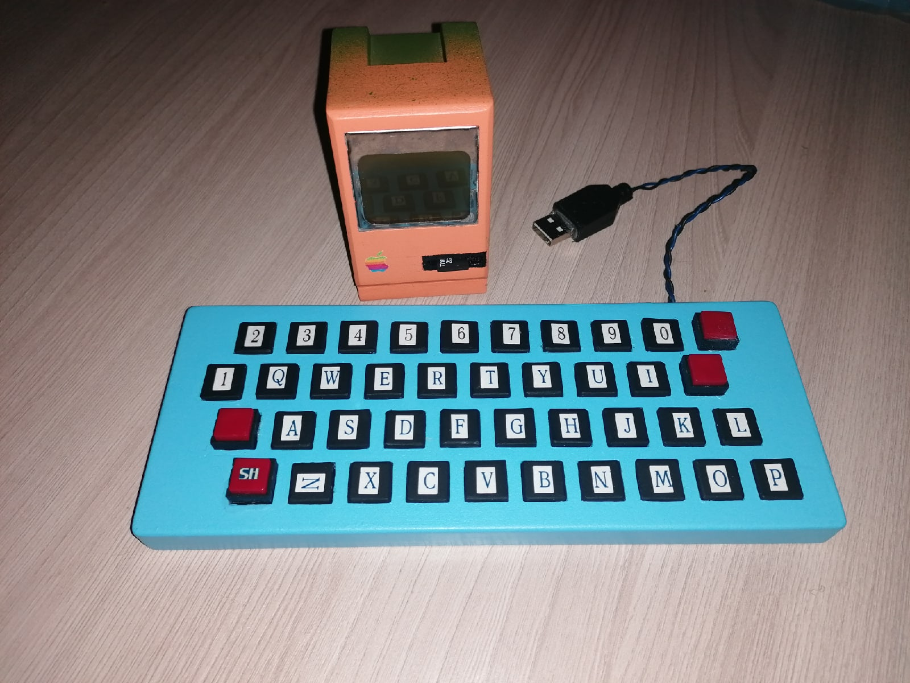

OzComp
======

### Общее описание

Мы создаем компьютер на базе Arduino с удобными инструкциями, которые позволяют просто общаться с устройствами,
не используя их интерфейсы, не зная ничего о их протоколах и интерфейсах, что сокращает размер исходного кода.
Так же наш проект расширяет возможности Arduino. Теперь ей доступно около 2 Гб (не больше) оперативной памяти,
которая представлена в виде FLASH-памяти на SD карте. Так же имеется теоретическая (пока нет утилит) возможность,
не прибегая к стороннему программированию (программатор, компьютер для загрузки прошивки и т.д.), писать программы,
которые будут работать на нашем компьютере. Помимо прочего, наш проект устраняет скорый износ внутренней FLASH-памяти
(например при частой смене программного обеспечения) и последующую негодность платы. Это происходит за счет наличия внешнего подключения SD карты.

Ниже дано краткое описание системы команд, регистров и архитектуры в целом.
+ По 16 регистров с именами R0-R15 для плавающей арифметики и для целых чисел.
+ Системные регистры в количестве 16 штук, сейчас используются 3 - для указателя на инструкцию, указателя на вершину стека и для флагов состояния.
+ Операции для чисел с плавающей запятой это арифметические, стековые и операции копирования (MOV), их имена предворяются знаком F (FADD, FMOV).
+ Все регистры 32-битные.

### Таблица распиновки
|Пин Arduino	| Пин устройства	|	Название устройства
|-:				|:-:				|:-
D2				| RST				|	Часы
D3				| CLK				|	Клавиатура
D4				| MOSI				|	Экран
D5				| DC				|	Экран
D6				| CE				|	Экран
D7				| RST				|	Экран
D8				| DATA				|	Клавиатура
D9				| CLK				|	Экран
D10				| CS				|	SD
D11				| MOSI				|	SD
D12				| MISO				|	SD
D13				| CLK				|	SD
A0				| DAT				|	Часы
A1				| R					|	RGB
A2				| CLK				|	Часы
A3				| +					|	Пьезо
A4				| G					|	RGB
A5				| B					|	RGB
A6				| C1				|	mini-jack
A7				| C2				|	mini-jack

### Память и системные регистры

+ Память реализована как SD-карта (в эмуляторе файл 'memory'). Программа стартует с нулевого байта.
+ SP это внутренний указатель на вершину стека, устанавливается в начале программы в значение равное объему памяти на SD карте.
+ IP это внутренний указатель на текущую инструкцию.
+ FLAGS это внутренний регистр состояния, состоит из 16 битов устанавливаемых автоматически при выполнении инструкций и 16 битов устанавливаемых
программно для задания состояния компьютеру.

#### Биты регистра флагов

|Номер	|Обозначение| Назначение
|-:		|:-:		|:-
0		| E			| Результат целочисленной арифметики дал значение 0
1		| L			| Результат целочисленной арифметики дал значение < 0
2		| G			| Результат целочисленной арифметики дал значение > 0
3		| I			| Отрисовка графических примитивов перетерла значение на экране
4		| Z			| Результат плавающей арифметики дал значение 0
5		| B			| Результат плавающей арифметики дал значение < 0
6		| A			| Результат плавающей арифметики дал значение > 0
7		| NI		| Отрисовка графических примитивов не перетерла значение на экране
8-15	| N/A		| Зарезервировано
16		| COLOR		| Задает цвет отрисовки графики
17		| RGBSOUND	| Подсвечивать светодиодами музыку 
18-31	| N/A		| Зарезервировано

### Экран

Экран - монохромный и имеет разрешение 84*48 пикселя, это 6 рядов по 84 колонки.
Каждый зажженый пиксель в колонке n от левого верхнего угла последовательно -
слева направо, сверху вниз, означает установленный бит сверху вниз n-го байта в памяти экрана.
Экран не позволяет узнать содержимое своей памяти, поэтому она хранится в памяти Arduino. 

### Клавиатура

Компьютер запускается только при наличии подключенной AT-совместимой клавиатуры (PS/2).

### Звуки

Звуковой источник - пьезо-пищалка, которая установлена на 17 пин Arduino.
Аудио код состоит из количества пар 16-битных чисел, частоты пищания и задержки.
Реально задержки нет, поскольку сигнал генерируется отдельным таймером Arduino.

### Обозначения

+ R - регистр
+ C - константа
+ L - метка
+ N/A - нет аргументов
+ M - ячейка памяти, запись вида [L, R1, R2, N \in {1, 2, 4}], где формула адреса такова L+R1+R2*N - слагаемые могут отсутствовать, синтаксически отделенные запятыми.

### Арифметические операции

|Название 	| Аргументы |	Описание
|-:			|:-:		|:-
ADD 		| R/(R,C)	| 	Сложение
SUB 		| R/(R,C)	| 	Вычитание
MUL 		| R/(R,C)	| 	Умножение
DIV 		| R/(R,C)	| 	Деление
MOD		 	| R/(R,C)	| 	Остаток от деления
POW			| R/(R,C)	| 	Возведение в степень
CMP			| R/(R,C)	| 	Изменить флаги вычитанием
TEST		| R			| 	Изменить флаги сравнением с нулем

### Логические операции

|Название 	| Аргументы |	Описание
|-:			|:-:		|:-
AND 		| R/(R,C)	|	Побитовое И целых частей операндов
OR  		| R/(R,C)	|	Побитовое ИЛИ целых частей операндов
XOR 		| R/(R,C)	|	Побитовое исключающее ИЛИ целых частей операндов
SHR 		| R/(R,C)	|	Битовый сдвиг вправо
SHL 		| R/(R,C)	|	Битовый сдвиг влево

***Общий пример для этих групп команд.***

+ ADD R0, R1
+ ADD R0, 1

### Переходы

|Название 			| Аргументы |	Описание
|-:					|:-:		|:-
JMP					| L			| 	Безусловный переход
J{E,G,L,I,A,B,Z,...}| L			| 	Условный переход по E, G, L
LOOP				| L			| 	Условный переход пока R14 больше 0
CALL				| L			| 	Безусловный переход с сохранением IP в стек 
RET					| N/A		| 	Извлечение IP из стека

***Общий пример для этой группы команд.***

+ JNE my_label
+ CALL my_func
+ RET

### Работа со стеком

|Название 	| Аргументы |	Описание
|-:			|:-:		|:-
PUSH		| R 		|	Положить на стек
POP			| R			|	Снять со стека
FPUSH		| R			|	Положить на стек флоатовское значение
FPOP		| R			|	Снять со стека флоатовское значение

***Примеры***

+ PUSH R0
+ FPOP R1

### Экран, клавиатура и динамик

|Название 	| Аргументы |	Описание
|-:			|:-:		|:-
FPRINT 		| (R,L) 	| 	Печать числа с плавающей запятой
LPRINT 		| (R,L) 	| 	Печать нуль-терминированной строки
PRINT		| (R,L) 	| 	Печать целого числа
SCUR		| R/R, C/C 	| 	Установка курсора на позицию X, Y
SEND		| (R,C)		| 	Отправка байта на экран в текущую позицию курсора
DRAW		| L			| 	Отправить 504 байта в память экрана из памяти с адреса L
GKEY		| N/A		| 	Получить символ клавиатуры в регистре R15, 0 если нет
SCOL  		| C 		| 	Установить цвет рисуемого изображения (0 или не 0 для монохромного экрана)
PLAY  		| L 		| 	Начать циклическое проигрывание музыки
NPLAY 		| N/A		| 	Завершить проигрывание музыки
RGB 		| R/R/R		| 	Установить цвет светодиодов
RGB 		| C/C/C		| 	Установить цвет светодиодов
MLS 		| N/A		| 	Узнать количество милисекунд, пройденных с запуска, в R12
MCS 		| N/A		| 	Узнать количество микросекунд, пройденных с запуска, в R12
RPIX 		| R/(R,C)	| 	Реверс нескольких подряд идущих столбцов экрана

***Примеры***

+ PRINT my_str
+ IPRINT R0
+ SETC R0, R5
+ SETC 10, 20
+ SEND R0 (<256)
+ SEND 85
+ GKEY

### Макрокоманды MCASM

|Название 	| Аргументы 	|	Описание
|-:			|:-:			|:-
DD			| C1, C2, ...	|	Создать несколько 32-битных чисел
DW			| C1, C2, ...	|	Создать несколько 16-битных чисел
DB			| C1, C2, ...	|	Создать несколько 8-битных чисел, (строки тоже)
DF			| C1, C2, ...	|	Создать несколько 32-битных чисел с плавающей запятой
TIMES 		| CMD ARGS  N 	|	Повторить команду CMD N раз

***Примеры***

+ DD -3, 100500, 0xffffffff
+ DB 10, 12, 255, "HELLO WORLD!"
+ DF 3.1415926535, 2.718281828
+ TIMES CALL INC 10

### Другие

|Название 	| Аргументы 	|	Описание
|-:			|:-:			|:-
MOV 		| R/(R,C,M),M/R | 	Перемещение данных во float
MOVB		| R/M,M/R 		|	Перемещение байтов в ячейки памяти
INT			| R				|	Округление
DELAY		| (R,C)			|	Задержка в милисекундах
RND			| N/A			| 	Случайное целое в промежутке [0, 1024], результат в R13
ICVTF 		| R/R 			| 	Конвертация float в int
FCVTI 		| R/R 			| 	Конвертация int в float
GTM 		| R/R/R			| 	Получить время RTC
STM 		| (R/R/R,C/C/C)	| 	Установить время RTC
MZER 		| (R,C)/(C,C)	| 	Занулить фиксированное количество байт по указателю

***Примеры***

+ MOV [my_var], R0
+ MOV R0, [my_var, R1]
+ INT R0
+ DELAY R1
+ DELAY 100
+ RND
