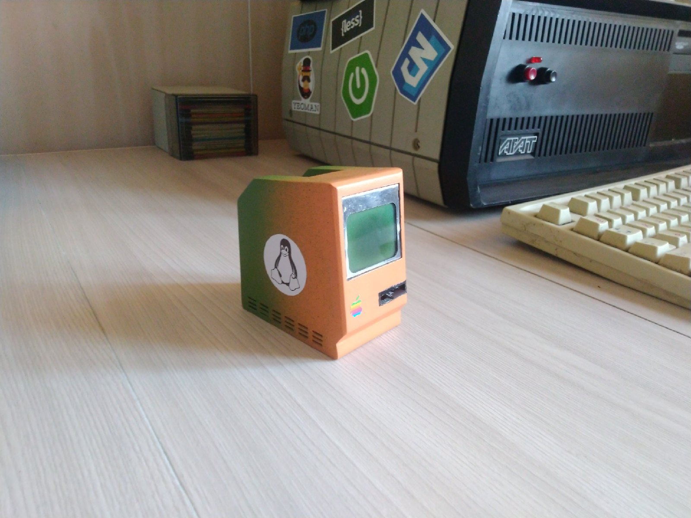

OzComp
======

### General description

All executions are with floating point numbers.
Registers keeps 32-bits floating point numbers.
There are instructions for converting to an integer type and outputting in it.

##### Memory

Memory is sd card (file 'memory' in emulator).
Program starts from 0 byte.
SP is internal pointer to the peek of stack. Initial state is 2147483648 (2 GB)
IP is internal pointer which points to current instruction
If CALL instruction is executed then IP puts in stack and SP decrease by 4.

##### Screen

The screen has 48*84 pixel resolution it is 6 lines in 8 pixels by 84 columns.
Screen has cursor which moves when screen gets data, more information in 'docs' folder.
If SEND instruction is executed then in screen sends byte it draws column which
match with cursor position according to the sent byte.

##### Ariphmetics
|Name 	| Arguments |	Decription
|-:|:-:|:-
ADD 	| R/(R,C)	| 	addition
SUB 	| R/(R,C)	| 	subtraction
MUL 	| R/(R,C)	| 	multiplication
DIV 	| R/(R,C)	| 	division
MOD 	| R/(R,C)	| 	modulo

| :        Fruits \|\| Food       : |||
| :--------- | :-------- | :--------  |
| Apple      | : Apple : | Apple      \
| Banana     |   Banana  | Banana     \
| Orange     |   Orange  | Orange     |
| :   Rowspan is 4    : || How's it?  |
|^^    A. Peach         ||   1. Fine :|
|^^    B. Orange        ||^^ 2. Bad   |
|^^    C. Banana        ||  It's OK!  |

##### Logics

|Name 	| Arguments |	Decription
|-:|:-:|:-
AND 	| R/(R,C)	|	read as (int)R AND (int)(R,C)
OR  	| R/(R,C)	|	read as (int)R OR (int)(R,C)
XOR 	| R/(R,C)	|	read as (int)R XOR (int)(R,C)

##### Jumps

|Name 	| Arguments |	Decription
|-:|:-:|:-
CMP		| R/(R,C)	| 	change flags by SUB
JMP		| L			| 	unconditional jump
J{E,G,L}| L			| 	conditional jump, where C is combination of E, G, L
LOOP	| L			| 	jumps while R14 > 0
CALL	| L			| 	saves IP in stack
RET		| N/A		| 	loads IP from stack

##### Stack

|Name 	| Arguments |	Decription
|-:|:-:|:-
PUSH	| R 		|	put in stack
POP		| R			|	pull off from stack

##### Screen and keyboard

|Name 	| Arguments |	Decription
|-:|:-:|:-
PRINT 	| (R,L) 	| 	R as double with 6 digits after point, L is pointer to 0-terminated line
IPRINT	| (R,L) 	| 	R as int
SETC	| R/R, C/C 	| 	sets cursor to X/Y, where both is byte
SEND	| (R,C)		| 	send byte in current cursor position (read R as R mod 256)
DRAW	| L			| 	send 504 bytes to screen from (0, 0) position by label L
GKEY	| N/A		| 	gets keyboard char in R15, 0 if no char

##### Assebler extensions

|Name 	| Arguments |	Decription
|-:|:-:|:-
DATA	| C1/C2 	|	repeat C2 times bytes of C1

##### Other

|Name 	| Arguments 	|	Decription
|-:|:-:|:-
MOV 	| R/(R,C,M),M/R | 	where M one of L, L+C, L+C+RO
INT		| R				|	drops fractional part
DELAY	| (R,C)			|	delay in milliseconds
RND		| N/A			| 	random int in [0, 1024)
